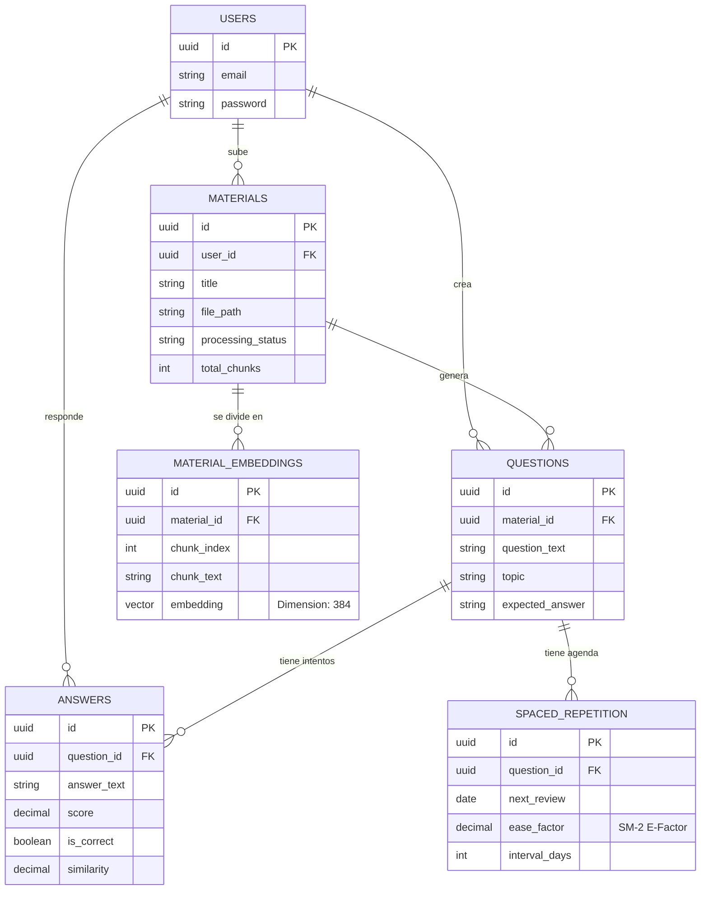
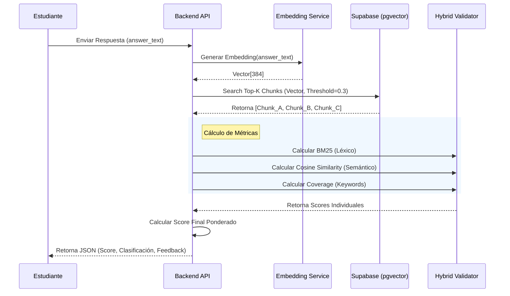

# ANEXO D: DOCUMENTO DE ARQUITECTURA DE SOFTWARE (DAS)

Este anexo detalla la estructura lógica, física y de datos del sistema **Recuiva**, utilizando diagramas estandarizados UML y Mermaid para representar la solución técnica implementada.

---

## D.1. Arquitectura General del Sistema

El sistema utiliza una arquitectura de microservicios contenerizados sobre infraestructura en la nube, optimizada para el procesamiento de IA y recuperación de información.

**Figura 1**
*Arquitectura de Componentes del Sistema Recuiva*

```mermaid
graph TD
    %% Estilos de Nodos
    classDef client fill:#f9f,stroke:#333,stroke-width:2px,color:black
    classDef frontend fill:#d4e1f5,stroke:#333,stroke-width:2px,color:black
    classDef backend fill:#d5f5e3,stroke:#333,stroke-width:2px,color:black
    classDef db fill:#fcf3cf,stroke:#333,stroke-width:2px,color:black
    classDef external fill:#e8daef,stroke:#333,stroke-width:2px,color:black,stroke-dasharray: 5 5
    classDef infra fill:#eaecee,stroke:#333,stroke-width:2px,color:black

    subgraph User_Side [Cliente]
        Browser[Navegador Web<br/>(HTML5 + JS + Tailwind)]:::client
    end

    subgraph Cloud_Infrastructure [Infraestructura (DigitalOcean Droplet - Dokploy)]
        direction TB
        
        Traefik[Traefik Proxy<br/>(SSL Terminación / Routing)]:::infra
        
        subgraph Docker_Swarm [Contenedores Docker]
            Nginx[Frontend Server<br/>(Nginx Container)]:::frontend
            
            subgraph Backend_App [Backend API (FastAPI)]
                API[API Gateway / Endpoints]:::backend
                
                subgraph Logic_Modules [Lógica de Negocio]
                    PDF_Proc[Procesador PDF]:::backend
                    Embed_Service[Servicio Embeddings]:::backend
                    Hybrid_Val[Validador Híbrido]:::backend
                    SM2_Algo[Algoritmo SM-2]:::backend
                end
            end
        end
    end

    subgraph External_Services [Servicios Externos & Datos]
        DuckDNS[DuckDNS]:::external
        
        subgraph Supabase_Cloud [Supabase Cloud]
            Postgres[(PostgreSQL DB)]:::db
            PgVector[(pgvector Ext)]:::db
            Auth_Service[Supabase Auth]:::external
        end
        
        Groq_API[Groq API<br/>(Llama 3.1 8B)]:::external
    end

    %% Conexiones Clave
    Browser -- HTTPS --> DuckDNS
    DuckDNS --> Traefik
    Traefik --> Nginx
    Traefik --> API
    API --> Auth_Service
    API --> Postgres
    Embed_Service --> PgVector
    API --> Groq_API
```
*Nota.* Muestra la integración entre el cliente web, el backend contenerizado en Dokploy, y los servicios externos de IA y Base de Datos. Elaborado por el autor.

---

## D.2. Modelo de Base de Datos (DER)

El esquema relacional implementado en PostgreSQL (Supabase) integra tablas convencionales con almacenamiento vectorial mediante la extensión `pgvector`.

**Figura 2**
*Diagrama Entidad-Relación (DER) de Recuiva*


*Nota.* Representa la estructura de datos para la gestión de usuarios, materiales, fragmentos vectoriales (embeddings) y lógica de repetición espaciada. Elaborado por el autor.

---

## D.3. Diagramas de Comportamiento (Secuencia)

Detalla el flujo lógico principal del sistema: la **Validación Semántica Híbrida**, que combina búsqueda vectorial y algoritmos de PNL para evaluar respuestas abiertas.

**Figura 3**
*Diagrama de Secuencia del Proceso de Validación Híbrida*


*Nota.* Ilustra la interacción entre los componentes para procesar una respuesta, recuperar el contexto semántico y aplicar el algoritmo de validación triple. Elaborado por el autor.

---

## D.4. Diagramas de Estado (Algoritmo SM-2)

Describe el ciclo de vida de una pregunta dentro del sistema de Repetición Espaciada, mostrando cómo cambian los estados según la calificación del estudiante.

**Figura 4**
*Diagrama de Estados del Algoritmo SuperMemo-2 (SM-2)*

```mermaid
stateDiagram-v2
    [*] --> New : Pregunta Creada
    
    New --> Learning : Primer Intento
    
    state Learning {
        [*] --> Initial_Interval : Intervalo = 1 día
        Initial_Interval --> Review_Pending : Espera fecha
    }

    Review_Pending --> Graded : Usuario Responde
    
    state Graded {
        choice Calificacion
        Graded --> Calificacion
        
        Calificacion --> Reset : Incorrecto (Score < 0.6)
        Calificacion --> Validation : Correcto (Score >= 0.6)
    }
    
    state Validation {
        [*] --> Update_EF : Recalcular E-Factor
        Update_EF --> Calculate_Interval : Nuevo Intervalo = I * EF
        Calculate_Interval --> Review_Pending : Reprogramar Siguiente Fecha
    }
    
    Reset --> Learning : Reiniciar Intervalo
    
    note right of Validation
        Si EF < 1.3, se fija en 1.3.
        El intervalo crece exponencialmente
        con cada acierto consecutivo.
    end note
```
*Nota.* Modela el flujo de estados de una pregunta (Nuevo, Aprendizaje, Repaso) gobernado por el rendimiento del usuario en cada sesión. Elaborado por el autor.
